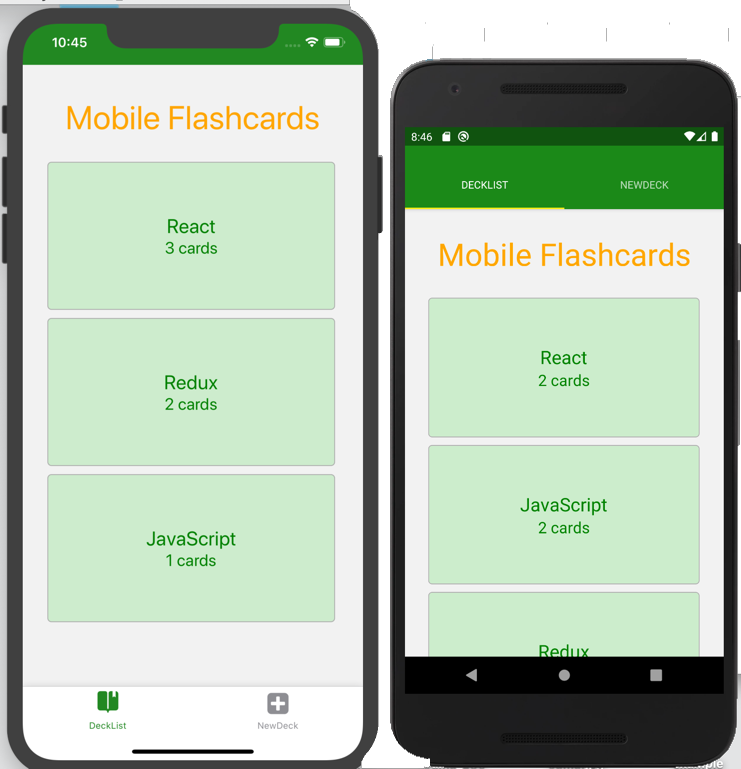
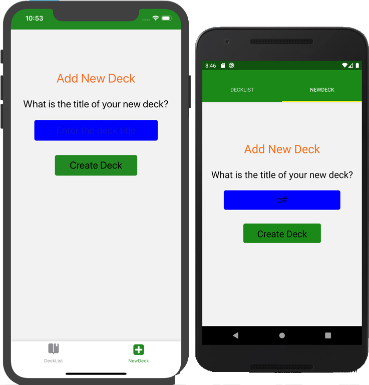
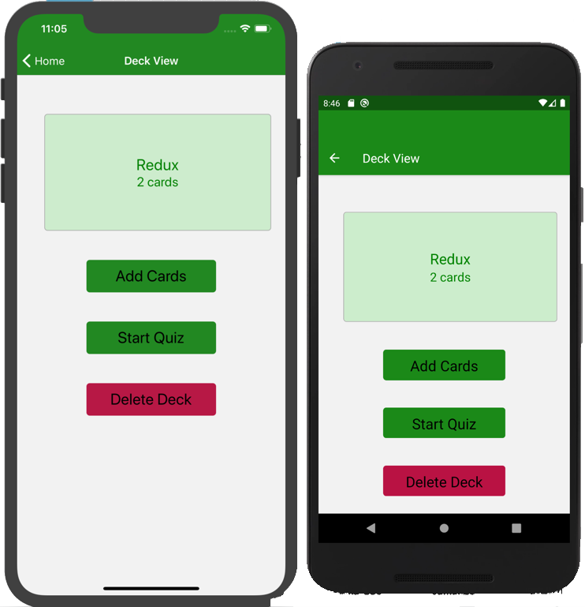
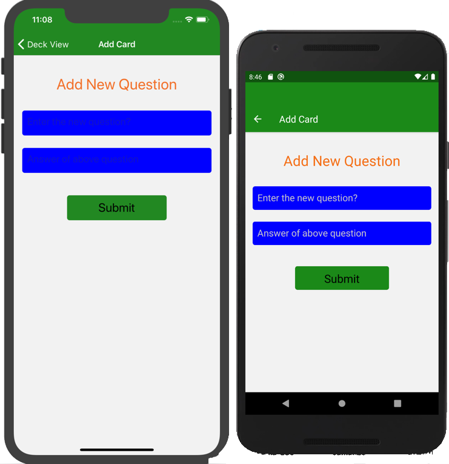
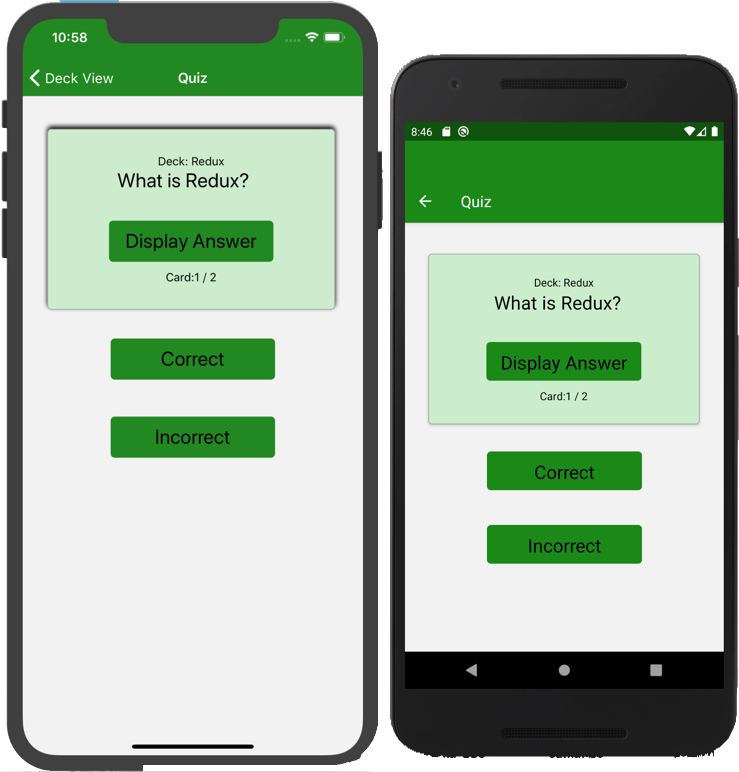
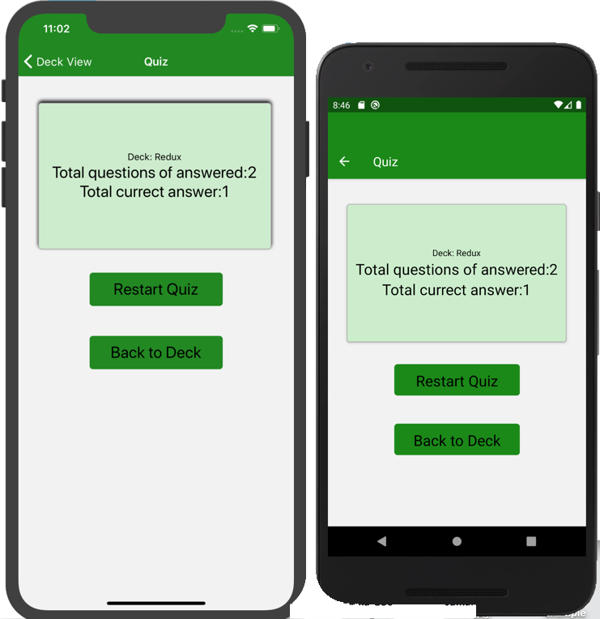

# Mobile FlashCards - Project

Mobile flashcards application. Its final project of udacity nanodegree Program. 
The Project developed by using React-Native app. This applicaton run on iOS and Andriod both device.This app have defferent-2 
flashcard, it's called a decks. Each deck have a set of card based on questions and answers.

## Installation

Upload Repository:  
    - git clone https://github.com/SumaPrajapati/ReactND_Mobile_FlashCards_App.git  
    - cd ReactND_Mobile_FlashCards_App  
    - yarn install  
    - yarn start  
    - Default browser will open with Metro Bundler running Port: [http://localhost:19002](http://localhost:19002) 
    
## Build App 

- Using create-react-native-app.  
- Node, Redux and AsyncStorage for data management  
- Expo - run the application on iOS and Andriod Emulator  
- Using XCode run the iOS simulator

## Flashcards OR Decks

Flashcards app run on the both iOS and Andriod device parallelly.

## Add New Deck 

In Add new deck, users can create their own deck. After creating new deck its shown in deck List.

## Individual Deck

Users select a deck to click on it from deck list and shown up in deckview.

## Add New Card

An add new card view users can create a new card for quiz with their question and answer for particular deck.

## Quiz View

A quiz view user can make it quiz of any Deck or Flashcard and each card have a question and an answer so user choose the 
answer whether its correct or incorrect of the question.

## Result

In this view user can see their result or score of the quiz.

    
